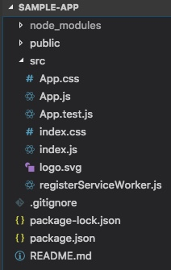
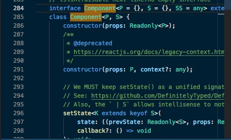
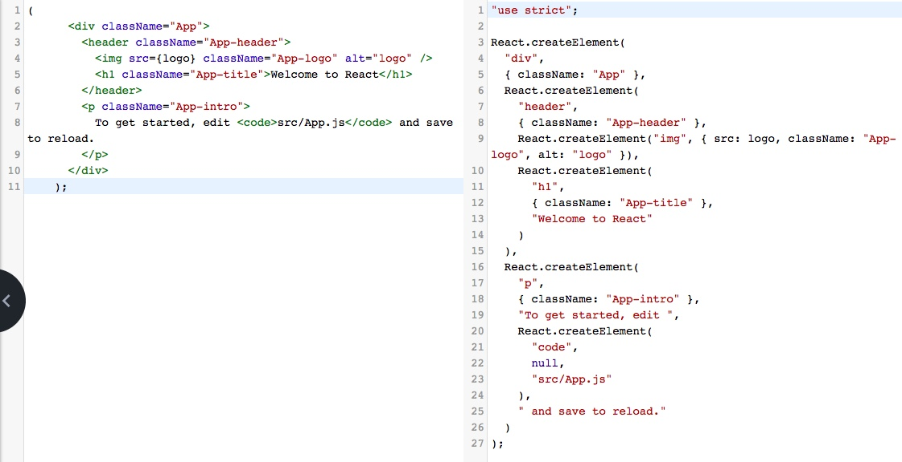

# JSX
- JSX는 JavaScript 와 XML을 합쳐서 만든 JavaScript의 확장 문법이다.
- JavaScript 안에 마크업 코드를 작성할 수 있고, property의 바인딩도 가능하다.
- JSX는 컴파일 되면서 최적화 되므로 빠르다.
	- 컴파일 되면서 js로 바뀜
- 확장자는 `.js` 를 사용하고 있다.

## 프로젝트 생성하기
React 홈페이지에서는 쉽게 리액트 프로젝트를 만들기 위해 `create react app`을 사용하라고 권장!

```
$ create-react-app my-app
```
my-app 이라는 폴더에 react 프로젝트가 설치된다.

```
$ cd my-app
$ npm start
```
입력하면 localhost:3000으로 서버가 실행된다.

## 파일들 살펴보기


App.js : 메인 컴포넌트 파일. jsx가 들어있음. 

```javascript
import React, { Component } from 'react';
import logo from './logo.svg';
import './App.css';

class App extends Component {
  render() {
    return (
      <div className="App">
        <header className="App-header">
          
          <h1 className="App-title">Welcome to React</h1>
        </header>
        <p className="App-intro">
          To get started, edit <code>src/App.js</code> and save to reload.
        </p>
      </div>
    );
  }
}

export default App;
```

위에서부터 살펴보면

```javascript
import React, { Component } from 'react';
import logo from './logo.svg';
import './App.css';
```

import 문으로 'react' 에서 (노드 모듈 안의 리액트의 index에서 가져온다) `React` 와 안에 있는 `Component` 를 불러온다.
Component는 React 안에 있는 Component 객체를 가져오는 것
> 더 자세한 내용은 es6 공부를 하다 보면 알게 된다 !

마찬가지로 logo.svg와 App.css 파일도 불러온다.
> 로고 파일과 css를 적용하기 위해서!

- 원래 html에서는 위에 src 이렇게 불러오는데 여기서는 javascript만 사용하기 때문에 import문 사용

```javascript
class App extends Component {
```

- App이라는 컴포넌트를 만들었는데 얘는 Component라는 React에서 가져온 애를 상속받아서 만든다.
- 앞으로 클래스 단을 만들 때에는 이런 식으로 사용.
- 나중엔 function으로 만드는 경우도 있는데 지금은 중요 X라 뺌

* Component라는 리액트에 들어가보면 (cmd + 클릭)

class Component에 constructor라는 initializing이 몇 개 있고 나중에 배울 state, render, forceUpdate 이런게 있는데 중요한 건 `render`라는 함수! 

이 클래스에서는 필수적으로 `render`가 필요함.

### ***render()***
: 컴포넌트에 렌더링 될 데이터를 정의함 / JSX 리턴.

```javascript
  render() {
    return (
      <div className="App">
        <header className="App-header">
          
          <h1 className="App-title">Welcome to React</h1>
        </header>
        <p className="App-intro">
          To get started, edit <code>src/App.js</code> and save to reload.
        </p>
      </div>
    );
  }
}
```
소괄호를 친 이 부분을 jsx라고 함.
jsx를 표현할 때는 무조건 **소괄호 안에** 넣어줘야 함.

div안에 여러개가 들어와 있음. 이게 jsx인데
render에서 jsx로 들어가게 되면 알아서 자바스크립트로 바꿔줌.
JSX를 보면 HTML 같지만, **JavaScript** 임!

https://babeljs.io 에 가서 (Try it out) 변환해보면 오른쪽과 같은 js 코드로 변환이 되는것을 확인할 수 있다.
>babel : es6를 es5로 바꿔줌. jsx도 바꿀 수 있다.



실제로 javascript로 작성을 하면 이런식으로 작성을 해야 함.
createElement로 div를 만드는 거,
className: "App" 이런 식으로 해서 xml로 짤, 우리가 일반적으로 html으로 짤 수 있는 것을 다 이런식으로 바꿔주는 형태로 짜게 됨.

초기에는 jsx가 필수가 아니다! 해서 오른쪽 처럼 짜는 사람도 있었는데 되게 코드가 별로 안 좋아져서 요새는 거의 jsx로 짠다고 생각하면 됨. 내부적으로 컴파일돼서 오른쪽처럼 되어 들어간다는 것!

컴파일을 한다는 것 --> 제약조건이 있다는 것!
(html처럼 마크업만 하는것은 아니니까)

## JSX 제약조건

##### 1. `render`에서 return을 할 때 jsx로 리턴을 하게 되는데 안에 있는 것들은 무조건 **태그를 닫아줘야 한다**

html 같은 경우, input 태그나 br은 close를 안하는데, jsx 에서 사용하게 되면 무조건 클로징을 해 줘야 한 블럭 블럭씩 보기 때문.
input이라던지, 나중에 되면 컴포넌트 단도 다 이런식으로 닫아줘야 한다. 커스텀 컴포넌트 같은 경우!

```
class App extends Component {
  render() {
    return (
      <div>
        <input type="text" />
      </div>
    );
  }
}
```

##### 2. **Element 감싸기**
가장 많이 하는 실수.
컴포넌트에서 여러 Element를 렌더링할 때 `container element` 안에 둬야한다.
> 예시에서는 element가 h1,h2 이고, container element가 div

```
// 에러
return  (
           <h1> Hello </h1>
           <h2> World </h2>
       );

// 성공
return  (
            <div>
              <h1> Hello </h1>
              <h2> World </h2>
            </div>
        );

// v16.2 부터는 Fragment 사용 가능
return  (
            <Fragment>
              <h1> Hello </h1>
              <h2> World </h2>
            </Fragment>
        );
```

그 이유는 리액트 컴포넌트가 구현되어 있는 `.d.ts` 파일을 참고하자

```typescript
interface ElementClass extends React.Component<any> {
    render(): React.ReactNode;
    // 리액트 내부 구조는 다 타입스크립트로 구현이 되어있다.
	// 그 중 render 함수의 반환형은 React.ReactNode 이고,
}

type ReactChild = ReactElement<any> | ReactText;
type ReactNode = ReactChild | ReactFragment | ReactPortal | string | number | boolean | null | undefined;

// ReactChile = ... | (바)가 있는데, 유니온 타입이라고 해서 여러가지 타입들 중에 하나가 들어갈 수 있는 것. 

namespace JSX {
        // tslint:disable-next-line:no-empty-interface
        interface Element extends React.ReactElement<any> { }
        interface ElementClass extends React.Component<any> {
            render(): React.ReactNode;
        }
        interface ElementAttributesProperty { props: {}; }
        interface ElementChildrenAttribute { children: {}; }
}

function createElement<P extends HTMLAttributes<T>, T extends HTMLElement>(
        type: keyof ReactHTML,
        props?: ClassAttributes<T> & P | null,
        ...children: ReactNode[]): DetailedReactHTMLElement<P, T>;

// 아까 babael에서 createElement 라는 함수를 썼는데, 이 함수의 구조를 봐도 타입이 ReactHTML 이라는 타입을 하나 받는데 HTML 이라는 element의 array 타입은 들어가지 않고, html 하나만 들어가야 해서 div로 감싸던지 하는 것.
```

- 최근에 16. version으로 올라가면서, <div>가 markup 단에서 좋지 않아서 최신에는 Fragment 사용.
- component를 여러개 보낼 때에는 fragment를 쓰기 전에 라이브러리를 써서 array 형태로 만들어주는 그런 라이브러리도 있었는데 지금은 그냥 fragment만 사용하면 될 것 같다. 

#####3. JSX 내부에 JavaScript 값을 사용해야 할 때는 { } 를 사용한다.

```javascript
class App extends Component {
  render() {
    const name = "World"
    //상수로 선언된 string 타입. 얘는 자바스크립트니까 안에 넣을 때 중괄호 사용.
    return (
      <div>
        <h1> Hello { name } </h1>
      </div>
    );
  }
}
```

##### Function
함수 쓸 때에도, 예를들어 onClick 할 때에도 onClick 하고 그 안에다가 넣어주면 된다.

```
onClickHandler() {
    alert("ssssss");
  }
```

이렇게 함수를 만들어주고, `render`안의 Button 에다가 onClick 하고 this에 onClick을 바인딩해주면 됨.

```
render() {
return(
...
<button onClick={this.onClickHandler}></button>
);
}
```

여기서도, 자바스크립트이기 때문에 중괄호를 써 줘야 함.
> onClick 같은거 모르면 nvm 참고하면 다 나오니까 그거 보기

##### 4. 주석
주석은 `//` 나 `{/* */}` 을 사용한다.

##### 5. 조건문
JSX 내부에서는 `if 문` 을 사용할 수 없다.
**삼항 연산자( ? : )** 와 **And 연산자(&&)** 를 사용하여 조건문을 사용한다.

```
// 삼항 연산자
class App extends Component {
  render() {
    const isVisible = true
    return (
      <div>
        {
            isVisible 
                ? (<div> true </div>)
                : (<div> false </div>)
        }
      </div>
    );
  }
}
```

```
// And 연산자
class App extends Component {
  render() {
    const isVisible = true
    return (
      <div>
        {
            isVisible && (<div> true </div>)
        }
      </div>
    );
  }
}
```

- `삼항 연산자` 는 조건이 true, false 일 때 각각 다른 요소들을 보여줄 때 사용한다.
- `And 연산자` 는 조건이 true 일 때만 보여줄 경우에 사용한다.
- 복잡한 로직의 경우 JSX 밖에서 처리를 하고, JSX 내부에서 해야한다면 **IIFE** 를 사용하자

## Style 과 CSS Class
: style 입힐 때에는 inline으로 많이 넣는데, 얘같은 경우는 div에다가 style을 javascript 형식으로 넣어줘야 한다. 

```javascript
class App extends Component {
  render() {
    const style = {
      backgroundColor: 'black',
      color: 'white'
    };

    return (
      <div style={style}>
        Hello, World
      </div>
    );
  }
}
```

이렇게 변수로 만들어 둬서 inline으로 만들수도 있지만 거의 안하고

```
class App extends Component {
  render() {
    return (
      // class 대신에 className을 사용한다.
      <div className="title">
        Hello, World
      </div>
    );
  }
}
```
- HTML에서 클래스를 설정할 때 class를 사용했다면 JSX에서는 className을 사용한다.
- 실질적으로 우리는 css를 import 해서 사용할텐데 import할 때 className이라는 키워드를 사용함.
- (카멜 구조, 리액트 자체가 cammel case 사용해서 모든 네이밍은 이렇게!)

```
React.createElement(
  'div',
  {className: 'title'},
  null
  // 여기는 Hello, world 가 꽂히겠죠 ,,
)
```
- 위의 JSX 는 대충 이렇게 변환되어 class가 설정된다.

## 실습
- Header.js 라는 컴포넌트를 하나 만든다.
- 13,44 ~~

